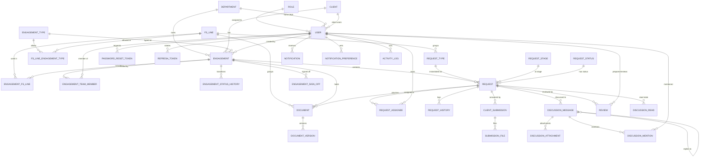

# Quantum — Entity Relationship Diagram (ERD)

> The relational schema for Quantum, derived from **DOMAIN_MODEL.md** and **USER_STORIES.md**.
> Target database: **PostgreSQL**, mapped with **MikroORM** (entities → snake_case tables). The schema is
> normalised to **3NF** — see [§5 Normalization](#5-normalization-1nf--2nf--3nf).
>
> **Auth note (monorepo direction):** authentication is JWT-based (issued by the NestJS `api`), so there
> are **no Auth.js session/account tables**. Instead a **`refresh_tokens`** table backs rotating-refresh
> with reuse detection (see §3.1).

---

## 1. Conventions

- **PK** = primary key, **FK** = foreign key, **UQ** = unique constraint.
- Surrogate keys are `*_id` (`uuid`/`cuid` in Prisma; shown as `id` generically). Human-facing codes
  (e.g. engagement `reference_code`) are separate **UQ** business keys.
- Every table has `created_at`; mutable tables also have `updated_at` (omitted from listings for brevity
  unless meaningful).
- **Lookup tables** (with their own attributes such as ordering) are real tables with FKs.
  **Fixed domains** with no attributes of their own (e.g. engagement status, category) are **DB enums** —
  this is a domain constraint, not a normalization violation (justified in §5).
- Junction (associative) tables carry **composite PKs** and model many-to-many relationships.

Enums used: `engagement_status` (Planning, Fieldwork, Review, Completed, Archived),
`engagement_member_role` (Partner, Manager, Auditor), `document_category` (WorkingPaper, FinalReport),
`submission_status` (Pending, Accepted, Returned), `review_status` (ForReview, Approved, SentBack).

---

## 2. ER diagram

> A standalone copy for full-screen rendering lives in **`ERD.mermaid`**.

---

## 3. Table specifications

### 3.1 Identity & reference

**roles**
| Column | Type | Key | Notes |
|--------|------|-----|-------|
| id | int | PK | |
| role_name | varchar | UQ | Platform Admin, Super Admin, Auditor, Staff, Client |

**departments** (formerly "service lines")
| id | int | PK |
| name | varchar | UQ |
| is_active | bool | | default true |

**clients** (organisation)
| id | uuid | PK |
| name | varchar | UQ |
| contact_email | varchar | |
| phone | varchar | |
| is_active | bool | |

**users**
| Column | Type | Key | Notes |
|--------|------|-----|-------|
| id | uuid | PK | |
| role_id | int | FK → roles.id | |
| department_id | int | FK → departments.id, null | staff home dept |
| client_id | uuid | FK → clients.id, null | set only for Client-role users |
| full_name | varchar | | |
| email | varchar | UQ | |
| password_hash | varchar | | bcrypt/argon2 |
| avatar_path | varchar | null | |
| is_active | bool | | |
| must_change_password | bool | | first-login gate |

**password_reset_tokens**
| id | uuid | PK |
| user_id | uuid | FK → users.id |
| token_hash | varchar | UQ |
| expires_at | timestamptz | |
| used_at | timestamptz | null |

**company_profile** (single-row firm profile)
| id | int | PK | fixed = 1 |
| name, logo_path, email, phone, address | | |
| updated_by | uuid | FK → users.id |

**refresh_tokens** — backs JWT rotating-refresh with reuse detection (replaces Auth.js sessions)
| Column | Type | Key | Notes |
|--------|------|-----|-------|
| id | uuid | PK | |
| user_id | uuid | FK → users.id | |
| token_hash | varchar | UQ | hash of the refresh token (never store raw) |
| family_id | uuid | | rotation family; on reuse, revoke the whole family |
| user_agent | varchar | null | device/session context |
| ip_address | inet | null | |
| expires_at | timestamptz | | |
| revoked_at | timestamptz | null | set on rotation/reuse/logout |
| created_at | timestamptz | | |

### 3.2 Catalogues (admin-maintained)

**engagement_types**
| id | int | PK | name UQ | is_active |

**fs_lines** — financial-statement line catalogue
| id | int | PK |
| code | varchar | UQ, null |
| name | varchar | UQ |
| description | text | null |
| is_active | bool | |

**fs_line_engagement_types** — which FS lines are allowed per engagement type (Q-C-3)
| fs_line_id | int | PK, FK → fs_lines.id |
| engagement_type_id | int | PK, FK → engagement_types.id |
*(Composite PK; empty set for a type ⇒ all FS lines allowed, enforced in service.)*

**request_types** — grouped **under an FS line** (Q-C-2)
| id | int | PK |
| fs_line_id | int | FK → fs_lines.id | the grouping |
| name | varchar | | UQ per fs_line_id |
| expected_documents | int | | legacy `documents_no` |
| is_active | bool | |

**request_stages**
| id | int | PK | name, sort_order, is_active |

**request_statuses**
| id | int | PK | name, sort_order, is_active |

### 3.3 Engagements

**engagements**
| Column | Type | Key | Notes |
|--------|------|-----|-------|
| id | uuid | PK | |
| client_id | uuid | FK → clients.id | |
| engagement_type_id | int | FK → engagement_types.id | |
| department_id | int | FK → departments.id | owning unit |
| reference_code | varchar | UQ | human-readable ID |
| title | varchar | | |
| period_label | varchar | null | e.g. FY2025 |
| status | enum engagement_status | | current status |
| start_date | date | null | |
| target_completion_date | date | null | |
| completed_at | timestamptz | null | |
| created_by | uuid | FK → users.id | |

**engagement_team_members** — junction (Q-E-3)
| engagement_id | uuid | PK, FK → engagements.id |
| user_id | uuid | PK, FK → users.id |
| member_role | enum engagement_member_role | | Partner/Manager/Auditor |
| assigned_by | uuid | FK → users.id |
| assigned_at | timestamptz | |

**engagement_fs_lines** — which FS lines are active in this engagement (Q-E-5)
| engagement_id | uuid | PK, FK → engagements.id |
| fs_line_id | int | PK, FK → fs_lines.id |
| sort_order | int | |
| added_by | uuid | FK → users.id |

**engagement_status_history** — transition log (Q-E-2)
| id | uuid | PK |
| engagement_id | uuid | FK → engagements.id |
| from_status | enum engagement_status | null |
| to_status | enum engagement_status | |
| changed_by | uuid | FK → users.id |
| changed_at | timestamptz | |
| note | text | null |

**engagement_sign_offs** — partner sign-off at engagement or FS-line level (Q-J-3)
| id | uuid | PK |
| engagement_id | uuid | FK → engagements.id |
| fs_line_id | int | FK → fs_lines.id, null | null = whole engagement |
| signed_by | uuid | FK → users.id |
| signed_at | timestamptz | |
| note | text | null |
| revoked_by | uuid | FK → users.id, null |
| revoked_at | timestamptz | null |
| revoke_reason | text | null |

### 3.4 Requests

**requests**
| Column | Type | Key | Notes |
|--------|------|-----|-------|
| id | uuid | PK | |
| engagement_id | uuid | FK → engagements.id | |
| request_type_id | int | FK → request_types.id | FS line derived via this |
| stage_id | int | FK → request_stages.id | |
| status_id | int | FK → request_statuses.id | |
| description | text | | |
| due_date | date | null | |
| created_by | uuid | FK → users.id | |
> FS line is **not** stored here — it is reached through `request_type_id → fs_lines.id` (3NF, §5.3).

**request_assignees** — junction (Q-F-3, supports multiple owners)
| request_id | uuid | PK, FK → requests.id |
| user_id | uuid | PK, FK → users.id |
| assigned_by | uuid | FK → users.id |
| assigned_at | timestamptz | |

**request_history** — per-request event log (Q-F-8)
| id | uuid | PK |
| request_id | uuid | FK → requests.id |
| actor_id | uuid | FK → users.id |
| event_type | varchar | | stage_change / status_change / assign / document / … |
| from_value | varchar | null |
| to_value | varchar | null |
| note | text | null |

### 3.5 Documents

**documents** — unified working papers **and** final reports (replaces legacy's 12 tables)
| Column | Type | Key | Notes |
|--------|------|-----|-------|
| id | uuid | PK | |
| engagement_id | uuid | FK → engagements.id | |
| fs_line_id | int | FK → fs_lines.id | canonical grouping key |
| request_id | uuid | FK → requests.id, null | null for FS-line-level final reports |
| category | enum document_category | | WorkingPaper / FinalReport |
| title | varchar | | |
| current_version_id | uuid | FK → document_versions.id, null | latest pointer (set post-insert) |
| uploaded_by | uuid | FK → users.id | |

**document_versions** — versioning (Q-G-4)
| id | uuid | PK |
| document_id | uuid | FK → documents.id |
| version_no | int | | UQ per document_id |
| storage_key | varchar | | R2 object key |
| file_name | varchar | |
| mime_type | varchar | |
| size_bytes | bigint | |
| uploaded_by | uuid | FK → users.id |
| uploaded_at | timestamptz | |

### 3.6 Client submissions

**client_submissions** — a client's response to a request (Q-H-2, Q-H-3)
| id | uuid | PK |
| request_id | uuid | FK → requests.id |
| submitted_by | uuid | FK → users.id |
| message | text | null |
| status | enum submission_status | | Pending/Accepted/Returned |
| reviewed_by | uuid | FK → users.id, null |
| review_reason | text | null | required on Returned |
| reviewed_at | timestamptz | null |

**submission_files**
| id | uuid | PK |
| submission_id | uuid | FK → client_submissions.id |
| storage_key, file_name, mime_type, size_bytes | | |

### 3.7 Discussions (Q-I)

**discussion_messages**
| id | uuid | PK |
| request_id | uuid | FK → requests.id |
| author_id | uuid | FK → users.id |
| parent_message_id | uuid | FK → discussion_messages.id, null | threaded replies |
| body | text | |
| edited_at | timestamptz | null |

**discussion_attachments**
| id | uuid | PK | message_id FK → discussion_messages.id | storage_key, file_name, mime_type, size_bytes |

**discussion_mentions** — junction (Q-I-4)
| message_id | uuid | PK, FK → discussion_messages.id |
| mentioned_user_id | uuid | PK, FK → users.id |

**discussion_reads** — per-user read pointer per request (Q-I-2; legacy `request_discussion_reads`)
| request_id | uuid | PK, FK → requests.id |
| user_id | uuid | PK, FK → users.id |
| last_read_message_id | uuid | FK → discussion_messages.id, null |
| updated_at | timestamptz | |

### 3.8 Reviews (Q-J)

**reviews** — preparer → reviewer workflow on a request
| id | uuid | PK |
| request_id | uuid | FK → requests.id |
| preparer_id | uuid | FK → users.id |
| reviewer_id | uuid | FK → users.id, null |
| status | enum review_status | | ForReview/Approved/SentBack |
| notes | text | null | required on SentBack |
| submitted_at | timestamptz | |
| decided_at | timestamptz | null |

### 3.9 Notifications & audit

**notifications** (Q-L-1)
| id | uuid | PK |
| user_id | uuid | FK → users.id |
| event_type | varchar | |
| entity_type | varchar | | soft ref (engagement/request/document/…) |
| entity_id | uuid | | soft ref (see §6) |
| title | varchar | |
| body | text | |
| link | varchar | null |
| is_read | bool | |
| read_at | timestamptz | null |

**notification_preferences** — junction (Q-L-2)
| user_id | uuid | PK, FK → users.id |
| event_type | varchar | PK |
| email_enabled | bool | |

**activity_log** — append-only audit trail (Q-N)
| id | uuid | PK |
| actor_id | uuid | FK → users.id, null | null = system |
| action | varchar | |
| entity_type | varchar | | soft ref |
| entity_id | uuid | | soft ref |
| ip_address | inet | null |
| metadata | jsonb | null | before/after snapshot |
| created_at | timestamptz | |

---

## 4. Relationship cardinality summary

| Relationship | Cardinality |
|--------------|-------------|
| Client → Engagement | 1 : N |
| EngagementType → Engagement | 1 : N |
| Department → Engagement | 1 : N |
| Engagement ↔ User (team) | **M : N** via `engagement_team_members` |
| Engagement ↔ FSLine (active lines) | **M : N** via `engagement_fs_lines` |
| EngagementType ↔ FSLine (allowed) | **M : N** via `fs_line_engagement_types` |
| Engagement → Request | 1 : N |
| FSLine → RequestType | 1 : N |
| RequestType → Request | 1 : N |
| Request ↔ User (assignees) | **M : N** via `request_assignees` |
| Request → Document | 1 : N (nullable) |
| Engagement → Document | 1 : N |
| FSLine → Document | 1 : N |
| Document → DocumentVersion | 1 : N |
| Request → ClientSubmission → SubmissionFile | 1 : N : N |
| Request → DiscussionMessage | 1 : N (self-ref for threads) |
| DiscussionMessage ↔ User (mentions) | **M : N** via `discussion_mentions` |
| Request ↔ User (read state) | **M : N** via `discussion_reads` |
| Request → Review | 1 : N |
| User → Notification | 1 : N |
| User ↔ event_type (prefs) | **M : N** via `notification_preferences` |

---

## 5. Normalization: 1NF → 2NF → 3NF

The schema is designed in **Third Normal Form**. Each step below states the rule and shows the
concrete design decisions that satisfy it.

### 5.1 First Normal Form (1NF)

**Rule:** every column holds a single atomic value; no repeating groups or multi-valued columns;
each table has a primary key; each row is unique.

Decisions:

1. **No multi-valued columns.** A request can have several assigned auditors. Rather than an
   `assignees` list column, each assignment is one row in **`request_assignees`**. Likewise a client
   submission's multiple files become rows in **`submission_files`**, and an engagement's FS lines
   become rows in **`engagement_fs_lines`**.
2. **No repeating groups.** The legacy app had **twelve** parallel tables
   (`audit_working_papers`, `tax_working_papers`, … `other_final_reports`) — a repeating structure
   keyed by service line. This is collapsed into a single **`documents`** table with a
   `category` enum and an `fs_line_id`; the "repeat" becomes data (rows), not schema.
3. **Atomic attributes.** Names, dates, sizes, and statuses are single scalar values. File binaries
   are not stored inline — `document_versions` stores a `storage_key` to R2 with atomic metadata columns.
4. **Every table has a PK** (surrogate `id`, or a composite key on junctions), guaranteeing row uniqueness.

### 5.2 Second Normal Form (2NF)

**Rule:** be in 1NF **and** have no partial dependency — every non-key attribute must depend on the
**whole** primary key. This only bites tables with **composite** keys (the junctions).

Decisions:

1. **`engagement_team_members`** (PK = `engagement_id` + `user_id`): the non-key attributes
   `member_role`, `assigned_by`, `assigned_at` describe *this specific membership* and depend on the
   whole key. The user's `full_name`/`email` depend on `user_id` **alone**, so they are **not** stored
   here — they live in `users`. The engagement's `title` depends on `engagement_id` alone — kept in
   `engagements`. No partial dependency remains.
2. **`engagement_fs_lines`** (PK = `engagement_id` + `fs_line_id`): `sort_order`/`added_by` depend on
   the pair. The FS line's `name`/`code` depend on `fs_line_id` alone → kept in `fs_lines`, never
   duplicated here.
3. **`notification_preferences`** (PK = `user_id` + `event_type`): `email_enabled` depends on both
   (a user's setting *for that event*). Nothing depends on only one part.
4. **`discussion_reads`**, **`request_assignees`**, **`fs_line_engagement_types`**,
   **`discussion_mentions`** follow the same rule — every non-key column depends on the full composite
   key, and single-part-dependent data is pushed to the parent table.

### 5.3 Third Normal Form (3NF)

**Rule:** be in 2NF **and** have no transitive dependency — non-key attributes must depend on the key,
the whole key, and **nothing but the key** (no non-key column determined by another non-key column).

Decisions:

1. **FS line not stored on `requests`.** A request's FS line is functionally determined by its
   `request_type_id` (`request_type → fs_line`). Storing `fs_line_id` on `requests` would be a
   transitive dependency (key → request_type → fs_line). It is therefore **derived by join**, not
   stored. (Grouping requests by FS line is a read-time join, per Q-F-5.)
2. **Client not stored on `requests`.** The client is reachable via `engagement_id → engagements.client_id`.
   Duplicating `client_id` on `requests` would be transitive through the engagement, so it is omitted.
3. **No denormalised names.** `users` stores `role_id`, not `role_name` (which depends on `role_id`,
   living in `roles`). `requests` store `stage_id`/`status_id`, not their labels. `documents` store
   `uploaded_by`, not the uploader's name. Every label lives once, in its lookup/parent table.
4. **Status labels vs. current status.** `request_stages`/`request_statuses` are **lookup tables**
   because they carry their own attribute (`sort_order`) and change over time — referencing them by id
   avoids repeating the label. Fixed, attribute-less domains (`engagement.status`, `document.category`,
   `submission.status`, `review.status`, `member_role`) are **enums** — a constraint on the column, not a
   separate fact that could cause a transitive dependency.
5. **`documents.fs_line_id` is a genuine attribute, not transitive.** Because `request_id` is
   **nullable** (final reports attach at FS-line level with no request), `fs_line_id` is the canonical,
   independent grouping key of a document — it is not determined by another non-key column in the row.
   When a working paper *is* tied to a request, keeping the two consistent is a service-layer rule,
   not a stored derivation.

**Result:** no repeating groups (1NF), no partial dependencies (2NF), and no transitive dependencies
(3NF). The schema also satisfies **BCNF** in practice, since every determinant of a functional
dependency is a candidate key.

---

## 6. Deliberate design notes

- **Soft references** on `notifications` and `activity_log` (`entity_type` + `entity_id`) are an
  intentional exception: an audit/notification row may point at any entity type, so a hard FK is not
  possible without polymorphism. Referential correctness there is enforced in the application layer.
  This does not affect the 3NF status of the business tables.
- **`documents.current_version_id`** is a convenience pointer to the newest `document_versions` row.
  It is nullable and set after the first version insert to avoid a circular insert dependency; the
  version history remains the source of truth.
- **Denormalisation for performance** (e.g. caching a client name or an unread count) is deliberately
  **not** in the base schema. If profiling later demands it, it will be added as clearly-marked,
  trigger/maintained derived columns — never as ad-hoc duplication.

---

## 7. Open items to confirm

1. **Engagement period** — keep `period_label` as free text, or model a `periods` table with start/end
   dates for reporting? (Ties to product open-question #1.)
2. **Review levels** — the `reviews` table supports single preparer→reviewer; multi-tier
   (manager → partner) would add a `review_level` or a chained-review model. (Product open-question #2.)
3. **Request ↔ FS line** — confirm requests always inherit FS line from request type (current 3NF
   assumption), i.e. no ad-hoc requests without a type.
4. **Client contacts** — is one login per client organisation enough, or do we need multiple client
   users mapped to one client (already supported via `users.client_id`)?
